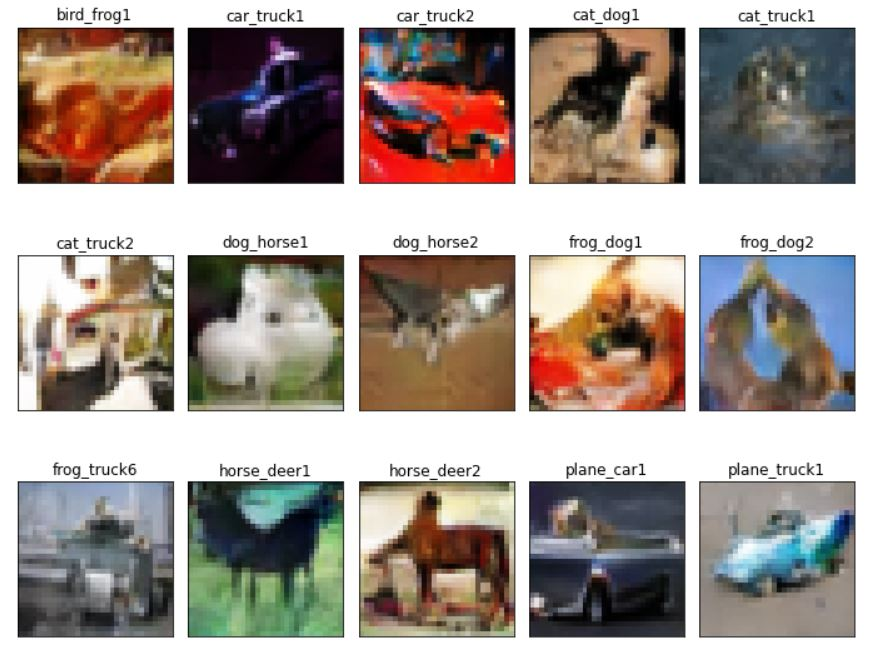
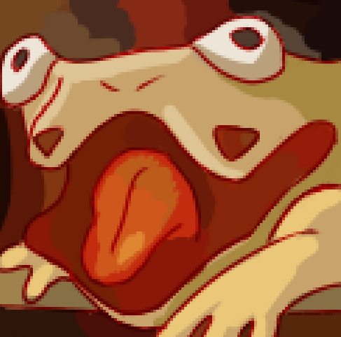
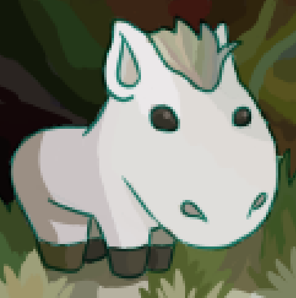

# CIFAR10-CGAN

This repository contains a student project in which a [Conditional Generative
Adversarial Network (CGAN)](https://arxiv.org/abs/1411.1784) is trained using 
the [CIFAR-10 dataset](https://www.cs.toronto.edu/~kriz/cifar.html) to create
novel images of hybrid classes.

As discussed in the main notebook, this is a small learning project with
some suggested steps that could be taken to further improve the results.
However, that doesn't mean there aren't some outputs to share:

Here are a couple artist's interpretations by my friend:

Bird_Frog1's Fortress      |  Dog_Horse1 in Repose
:-------------------------:|:-------------------------:
  |  

References

* [Conditional Generative Adversarial Network (CGAN)](https://arxiv.org/abs/1411.1784)
* [Conditional GAN Example (Keras)](https://keras.io/examples/generative/conditional_gan/)
* [CIFAR GAN Example (Machine Learning Mastery)](https://machinelearningmastery.com/how-to-develop-a-generative-adversarial-network-for-a-cifar-10-small-object-photographs-from-scratch/)
